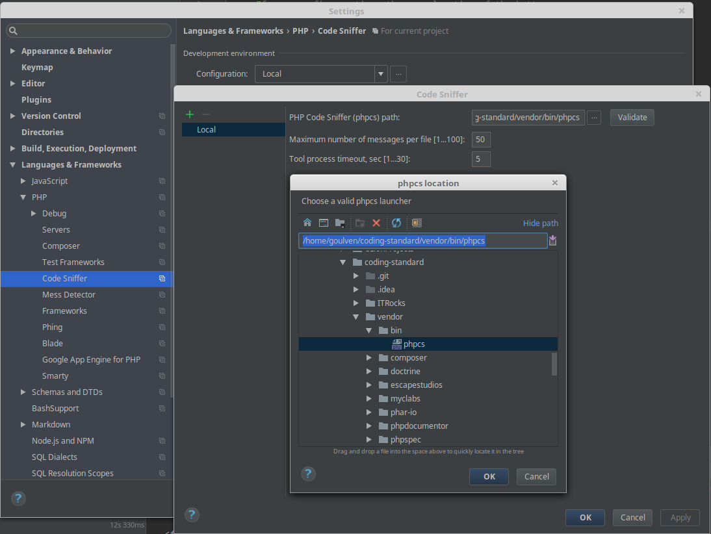
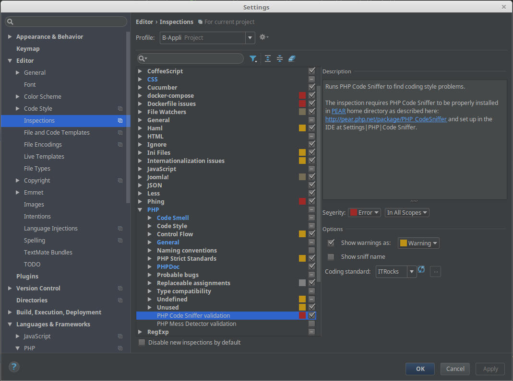

# ITRocks PHP CodeSNiffer Codeing Standard
A coding standard to check against the ITRocks coding standards.

## 1. Installation
### 1.1 Composer
This standard can be installed with Composer dependency manager:

1. Install Composer
2. Install coding standard as a dependcy of your project

TODO
```
composer require --dev ...
```

3. Add the coding standard to the PHP_CodeSniffer install path
```
 vendor/bin/phpcs --config-set installed_paths vendor/itrocks/coding-standards
```

4. Check the installed coding standards for "ITRocks"
```
vendor/bin/phpcs -i
```

5. Done!
```
vendor/bin/phpcs --standard=ITRocks /path/to/code
```

### 1.2 Stand-alone
1. Checkout this repository
```
git clone https://gitlab.bappli.com/itrocks/coding-standard
```

2. Install dependencies
```bash
cd coding-standards && composer install
```

3. Check the installed coding standards for "ITRocks"
```bash
vendor/bin/phpcs -i
```

4. Usage
```bash
vendor/bin/phpcs --standard=ITRocks /path/to/code
```

## 2. Debug CI

* Install container

	```bash
	sudo docker run -dit --name cs \
   -v $HOME/.ssh:/root/.ssh \
   php:7.1.1
	```
	
* Connect to docker
	```bash
	sudo docker exec -it cs /bin/bash
	```

	* Install project
  	```bash
  	apt update -yqq && apt install -y git zip
  	mkdir -p /builds/itrocks
  	cd /builds/itrocks
  	git clone git@gitlab.bappli.com:itrocks/coding-standard.git
  	cd coding-standard
  	```
  
	* Checkout branch required / Modify composer as you want

	* Install
	```bash
  curl -sS https://getcomposer.org/installer | php
  php composer.phar install
  ```
  
  * Run jobs
  ```bash
	vendor/bin/phpunit --colors=never
  ```

## 3. Run unit tests
From project's root, create a simlink in phpcs standards directory:
```
ln -s ITRocks/ vendor/squizlabs/php_codesniffer/src/Standards
```

Then, run unit tests as following:
```
vendor/bin/phpunit --filter ITRocks* vendor/squizlabs/php_codesniffer/tests/AllTests.php
```


## 4. PhpStorm integration
After having [cloned this project on your disk](#12-stand-alone), you're able to integrate coding standards rules directly in PhpStorm.

Go in PhpStorm settings `Languages & Framework > PHP > Code Sniffer` to configure the path of phpcs executable:




Click on Apply button.

Now, go to: `Editor > Inspections > PHP > PHP Code Sniffer validation`, check the checkbox and configure as following:




That's it !

To inspect a file/directory, just right click on it in the project windows, select "Inspect Code...", then OK !
