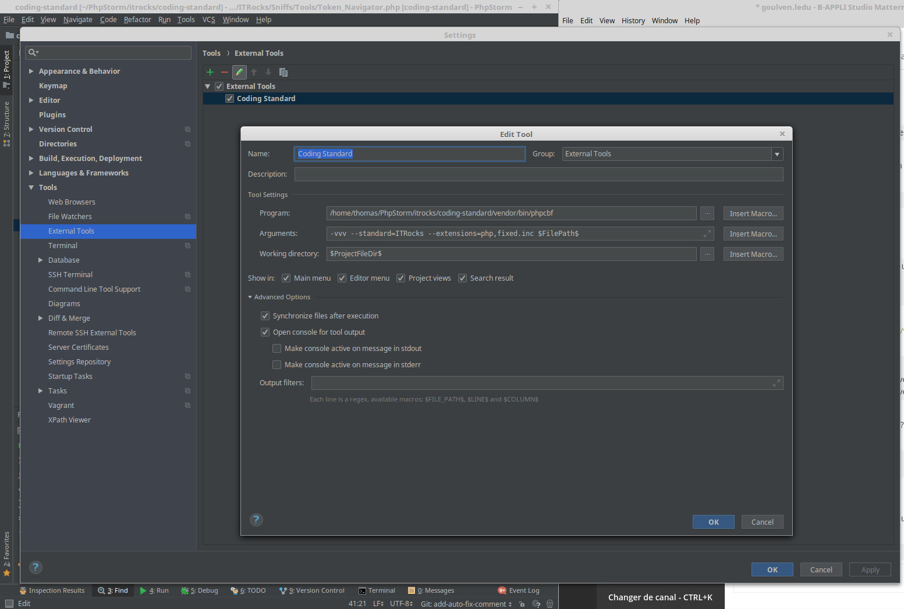

# it.rocks PHP CodeSNiffer Coding Standard 

A coding standard to check against the it.rocks coding standards.

## 1. Installation
### 1.1 Composer

This standard can be installed with Composer dependency manager:

1. Install Composer

2. Install coding standard as a dependency of your project

```bash
composer require --dev itrocks/coding-standard
```

3. Check the installed coding standards for "ITRocks"
```
vendor/bin/phpcs -i
```

Should display the ITRocks coding standard, between others

4. If needed, add the coding standard to the PHP_CodeSniffer install path

```bash
vendor/bin/phpcs --config-set installed_paths `realpath vendor/itrocks/coding-standard/ITRocks`
```

5. Done!

```bash
vendor/bin/phpcs --standard=ITRocks ./
```

### 1.2 Stand-alone

1. Checkout this repository

```bash
git clone https://git.crafter.fr/itrocks/coding-standard
```

2. Install dependencies

```bash
cd coding-standard
composer install
```

3. Check the installed coding standards for "ITRocks"

```bash
vendor/bin/phpcs -i
```

4. If needed, add the coding standard to the PHP_CodeSniffer install path

```bash
vendor/bin/phpcs --config-set installed_paths `realpath ITRocks`
```

5. Usage

```bash
vendor/bin/phpcs --standard=ITRocks /home/vendor/project
```

You can check that this tools himself respect ITRocks standard

```bash
vendor/bin/phpcs --standard=ITRocks --extensions=php $CI_PROJECT_DIR/ITRocks
```

## 2. Run unit tests

### From the command line

Simply run

```bash
vendor/bin/phpunit
```

### From PHPStorm, with PHP installed locally

Right-click on "phpunit.xml.dist" and select "Run phpunit.xml.dist".

This works only for coding-standard being installed into a dependency of your project. If you want
to run tests on a standalone mode, you have to change this file path into the phpunit.xml.dist file :
- for dependency : bootstrap="../../../vendor/squizlabs/php_codesniffer/tests/bootstrap.php"
- for standalone : bootstrap="vendor/squizlabs/php_codesniffer/tests/bootstrap.php"

## 3. PhpStorm integration

After having [cloned this project on your disk](#12-stand-alone),
you're able to integrate coding standards rules directly in PhpStorm.

Go in PhpStorm settings `Languages & Framework > PHP > Code Sniffer` to configure the path of phpcs executable:


Click on Apply button.

Now, go to: `Editor > Inspections > PHP > PHP Code Sniffer validation`, check the checkbox and configure as following:


That's it!

To inspect a file/directory, just right click on it in the project windows, select "Inspect Code...", then OK.

## 4. PhpStorm AutoFix

1. Go to Settings -> Tools -> External tools
2. Configure the following
  * Name : Apply Coding Standards
  * Program : ```/home/vendor/project/vendor/bin/phpcbf``` (Use the path to your project)
  * Arguments : ```-vvv --standard=ITRocks --extensions=php,fixed.inc $FilePath$```
  * Project directory : ```$ProjectFileDir$```
    
3. Go to Settings -> Keymap -> External Tools -> Coding Standard
  * Right click -> Add Keyboard Shortcut
  * Add : Ctrl+<
  
Now you can auto-fix your php files using the Ctrl+< keyboard combination, or the menu
Tools -> External Tools -> Apply Coding Standards
